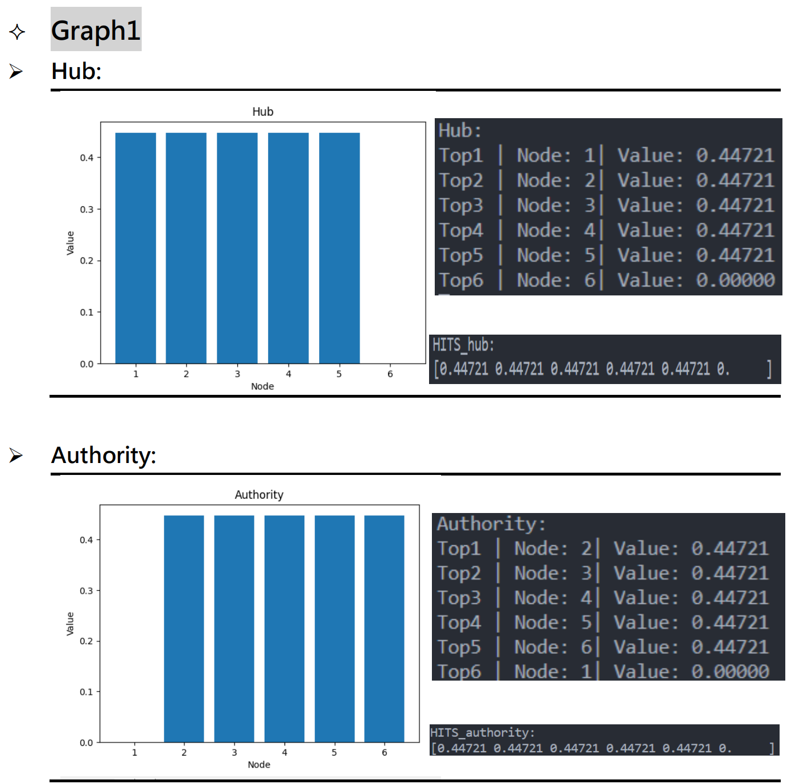
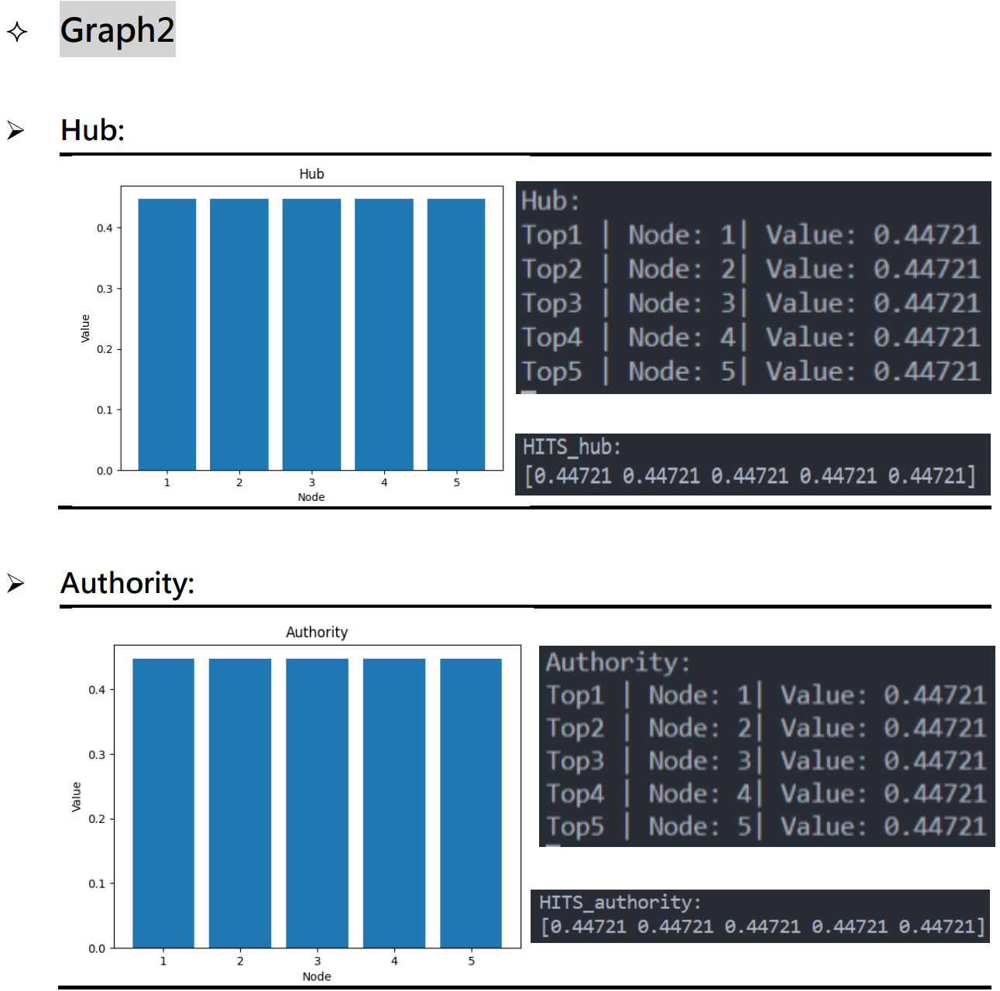
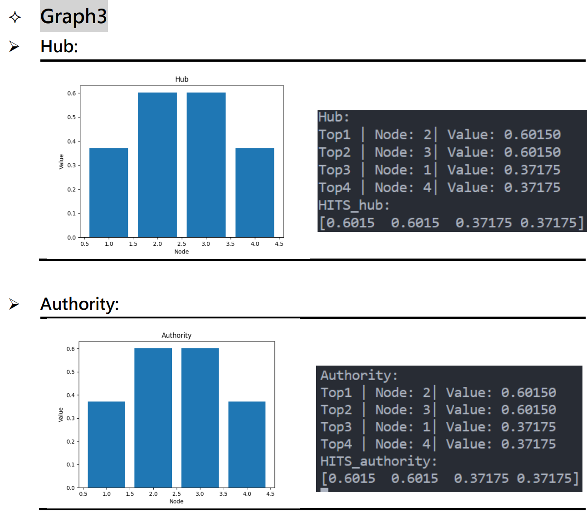
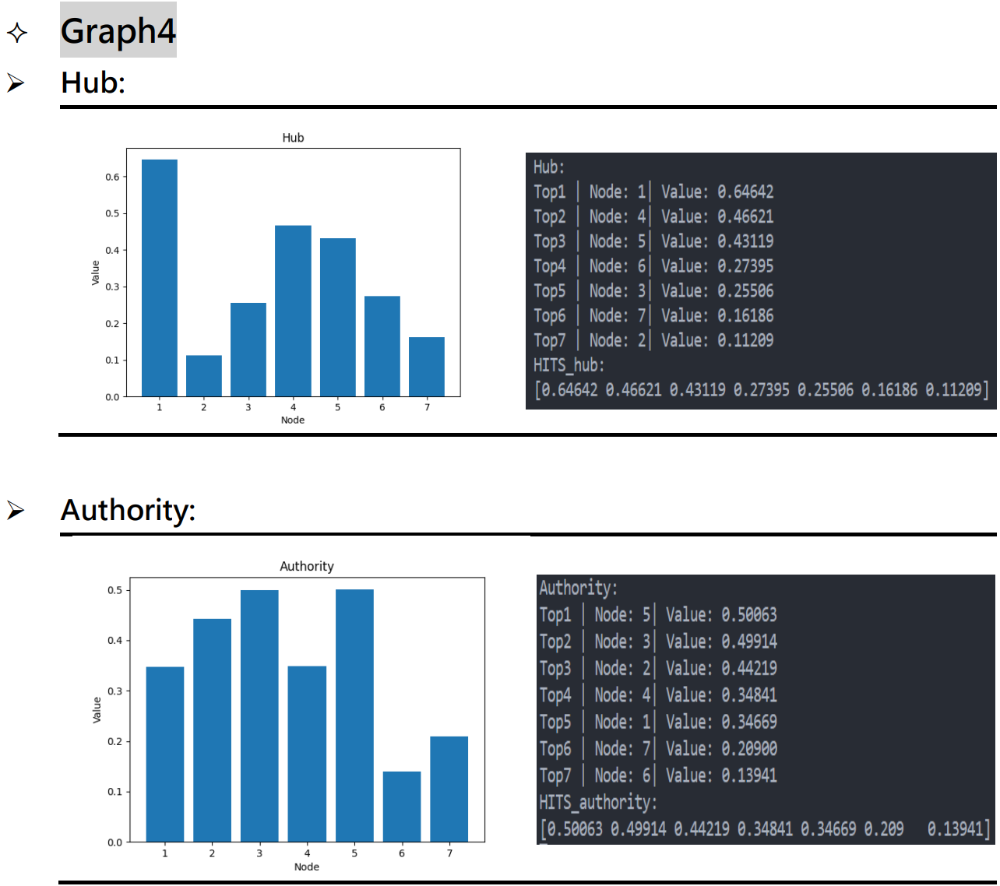
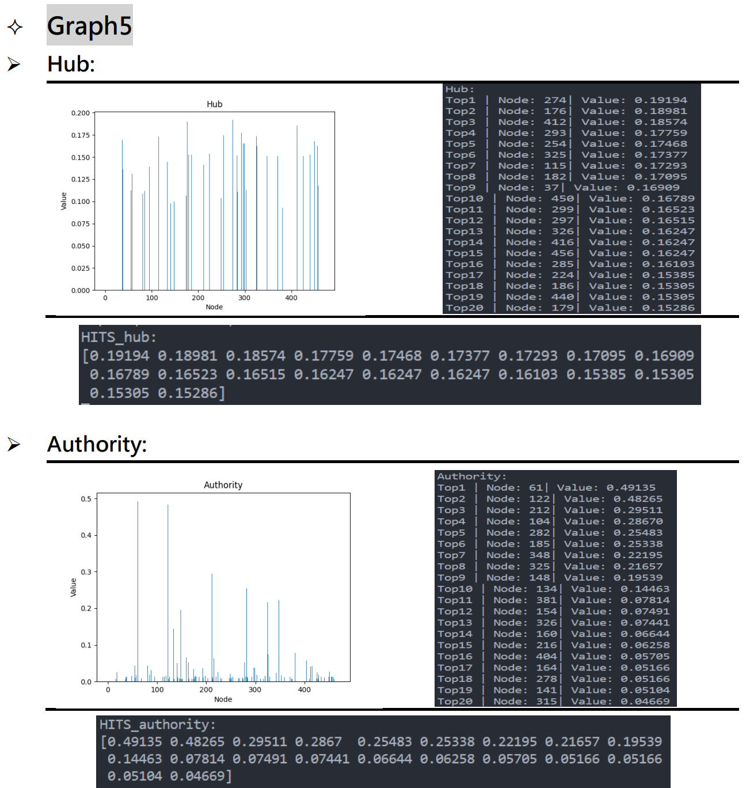
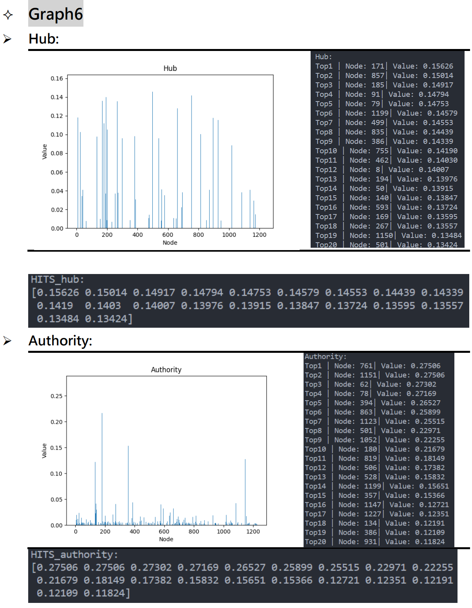
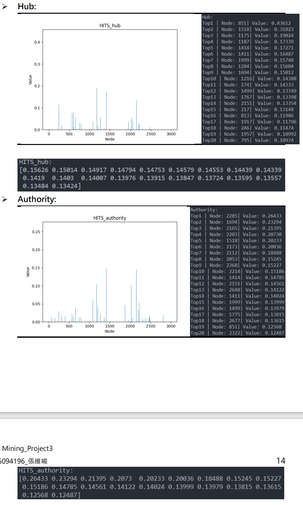

# DM_LinkAnalysis

* Outline
1. File structure
2. Implment
3. Graph
4. Result
5. How to Increase Hub, Authority and PageRank?
6. Discussion

## 1.File structure

```
\+ -- algorithm
    |   + -- Alg_Node_Graph.py
\+ -- figures
\+ -- hw3datset
\+ -- ouput
\+ -- script_exp
    |   + -- P1_graph1.py
    |   + -- P2_graph2.py
    |   + -- P3_graph3.py
    |   + -- P4_graph4.py
    |   + -- P5_graph5.py
    |   + -- P6_graph6.py
    |   + -- P7_graph7.py
\+ -- tool
    |   + -- trans2graph.py
```

* algorithm/Alg_Node_Graph.py: 讀入圖片,建立節點。
* figures/: 存放輸出的圖片
* hw3datset: 資料集
* ouput/: 存放目標檔案格式
* script_exp/:檔案執行範例

## 2.Implement
* **HITS**
    * 使用 list 結構記錄每個節點 Authority 和 hub 值,並且初始化成 1 / n ^ 0.5。
    * 程式邏輯-進入迴圈
        - 對每個節點，將其 Authority 更新為其全部父節點之 Hub 值總和。將其 Hub 更新為其全部子節點之 Authority 值總和。
        - 將全部 Authority 除以全部 Authority 平方和開根號 (歐基理德距離)
        - 將全部 Hub 除以全部 Hub 平方和開根號 (歐基理德距離)
        - 如果新舊 Authority 之差值平方和，加上新舊 Hub 之差值平方和小於epsilon。(default: 1e‑10)，則跳出迴圈。
    * 輸出 Authority 及 Hub list。
* **PageRank**
    * 使用 list 結構記錄每個節點 PageRank 的值,初始化成 1 / n ^ 0.5。
    * 程式邏輯-進入迴圈
        - 對每個節點，將其 PageRank 更新為 d 除以總節點數，加上(1-d)乘以其全部父節點 PageRank 值除以父節點對外分支數的總和(default : d=0.1)
        - 將全部 Authority 除以全部 Authority 平方和開根號 (歐基理德距離)
        - 將全部 Hub 除以全部 Hub 平方和開根號 (歐基理德距離)
        - 如果新舊 Authority 之差值平方和，加上新舊 Hub 之差值平方和小於epsilon。(default: 1e‑10)，則跳出迴圈。
    * 輸出 Authority 及 Hub list
* **SimRank**
    * 建立一個 dictionary 來儲存節點與節點之間的倆倆 SimRank 值，並初始化自己對自己的 SimRank 為 1 ，其餘的 SimRank 為 0 。
    * 程式邏輯-進入迴圈
        - 對於全部節點中的倆倆配對 a, b 節點，其中 a 不等於 b ，將SimRank(a, b) 及 SimRank(b, a) 更新為 C 除以 a 之父節點數，除以b 之父節點數，乘以全部 a 之父節點配對上全部 b 之父節點之SimRank 總和。(default: C=1.0)
        - 如果更新前後 SimRank 之差值平方和小於 epsilon(default: 1e‑10)，則跳出迴圈。
    * 輸出 SimRank dictionary。

## 3.Graph
* Graph 1 
```
1 -> 2 -> 3 -> 4 -> 5 -> 6
```

* Graph 2
```
+-------------------+
c                   |
1 -> 2 -> 3 -> 4 -> 5
```

* Graph 3
```
1 <-> 2 <-> 3 <-> 4 
```

* Graph 4
```
Node 1
In Node: [2, 3, 5, 6]
Out Node: [2, 3, 4, 5, 7]
Node 2
In Node: [1, 3, 4]
Out Node: [1]
Node 3
In Node: [1, 4, 5]
Out Node: [1, 2]
Node 4
In Node: [1, 5]
Out Node: [2, 3, 5]
Node 5
In Node: [1, 4, 6, 7]
Out Node: [1, 3, 4, 6]
Node 7
In Node: [1]
Out Node: [5]
Node 6
In Node: [5]
Out Node: [1, 5]
```

## 4.Result
### Graph1 


* Discussion:
    1. 由節點連線關係可以看的出來 Node1 並沒有被其他節點指向(推薦)，因此其 Authority 值為 0 ，其他節點都可以接收其父節點之 Hub 值為其Authority 值。
    2. 由節點連線關係可以看的出來 Node6 並沒有指向(推薦)其他節點，因此其 Hub 值為 0 ，其他節點都可以接收其子節點之 Authority 值為其Hub 值。
    3. 因此說明了如果對外指向的節點數愈多 Hub 就會有機會愈高，如果被愈多點指向則 Authority 將會有機會愈高。

### Graph2


* Discussion:
    1. 因為這個 Graph 是一個環狀，每個節點都是被前一個節點指向，同時也指向下一個節點，沒有任何差異，因此不論在 Hub 及 Authority 皆為一致。
    2. 如果將此環狀架構打破一個 edge 那麼就會跟 graph1 一樣，最末端的節點 Hub 值為 0 ，最前端節點 Authority 為 0。

### Graph3


* Discussion:
    1. 因為這個 Graph 是一個環狀，每個節點都是被前一個節點指向，同時也指向下一個節點，沒有任何差異，因此不論在 Hub 及 Authority 皆為一致。
    2. 如果將此環狀架構打破一個 edge 那麼就會跟 graph1 一樣，最末端的節點 Hub 值為 0 ，最前端節點 Authority 為 0。

### Graph4


*  Discussion:
    1. 觀察 HUB 圖表,node1 推薦 2,3,4,5,7 這些高 authority 的 node,所以hub 值相對高於其他 node。node2 只推薦了 node1 這個低 authority的節點,因此 hub 值相對低於其他 node。
    2. 觀察 Authority 圖表,node3,5 兩個點被推薦的次數最多, 因此相較於其他節點 authority 是高的。Node6 只被 Node5 推薦，因此 Node6 之authority 相較其他節點為最低的。

### Graph5


* Discussion:
    1. 觀察 HUB 圖表,node274 推薦 61,104,122…. 這些高 authority 的node 幾乎都推薦到了,所以 hub 值相對高於其他 node。沒有推薦其他節點的 node, hub 值皆為 0。
    2. 觀察 Authority 圖表,node6 被節點 274,176,412…. 推薦，這些高hub 值的 node 幾乎都推薦到了,所以 authority 值相對高於其他node。至於沒有被推薦的節點,authority 值為 0。

### Graph6


* Discussion:
    1. 觀察 HUB 圖表,node171 推薦 761,1151,62…. 這些高 authority 的node 幾乎都推薦到了,所以 hub 值相對高於其他 node。完全沒有推薦其他節點的 node, hub 值皆為 0。
    2. 觀察 Authority 圖表,node761 被節點 171,857,185…. 推薦，這些高 hub 值的 node 幾乎都推薦到了,所以 authority 值相對高於其他node。至於沒有被推薦的節點,authority 值為 0。

### Graph7 
本資料的構成是由 project1 之 IBM dataset 構成，將每個 transaction 的各個 item 以單向連接到下一個 item，詳見 graph 



* Discussion:
    1. 觀察 HUB 圖表,node851 推薦 2285,1694,2165…. 這些高authority 的 node 幾乎都推薦到了,所以 hub 值相對高於其他node。沒有推薦其他節點的 node, hub 值皆為 0。
    2. 觀察 Authority 圖表,node2885 被節點 851,1518,1175…. 推薦，這些高 hub 值的 node 幾乎都推薦到了,所以 authority 值相對高於其他 node。至於沒有被推薦的節點,authority 值為 0。

## PageRank ,SimRank, 5.How to Increase Hub, Authority and PageRank?詳情見PDF檔案
## 6. Discussion
### ➢ What are practical issues when implement these algorithms in a real Web? 
想把這要應用到實際上網站上，面臨最關鍵的問題在於計算時間，這樣的分析所需計算時間會隨著節點數及邊數的提升而有快速成長的趨勢，而真實的搜尋引擎要處理的網站節點量可想而知是超出我們實驗範圍很多的，像是 google 隨便搜尋一個辭彙都會在 0.5 秒鐘內找出 5,000 多萬以上個符合網站，如此才能 提供使用者一個可接受的搜尋，但我們實驗中 |V| = 10,000, |E| = 10,000,000 就要跑個 半分鐘以上，實在是很難被使用者所接受，因此要把這樣的方法應用到實際的運作上存在難以克服的難度。

###  ➢ Any new idea about the link analysis algorithm? 
link analysis algorithm 面臨最大的問題在於運算時間需要很大的負擔，在面臨真實網站處理時，這麼漫長的處理時間是不被允許的，或許我們可以先行依據 similarity進行網站的分群，把相似度高的網站組合成群，如此一來搜尋引擎在搜尋網站時可以直接計算每個大群的 PageRank 或是 Authority ，在近一步到這些評分較高的網站群內，再做群內部的 PageRank 或是 Authority 計算工作，這或許會舒緩龐大的運算量。

### ➢ What is the effect of “C” parameter in SimRank?
觀察前面的 result ，在兩兩配對的節點計算 SimRank 時，會因為兩節點想透過遞迴去找尋到相同的父節點，但每通過一層的遞迴所繼承而來的 SimRank 都會被 C 值所減少，因此隨著 C 值的設定愈接近 0 的話，兩兩不同的節點互相配對其 SimRank 值必定 會愈接近 0 ，而 C 值愈接近 1 的話，兩兩不同的節點互相配對，在追溯到共同父節點時，其繼承的 SimRank 將不會有折減。

### ➢ What you learned from this project and your comments about this project?
實作出來的演算法計算速度遠遠不足實際上搜尋引擎的要求。在 project 中，我瞭解到搜尋引擎的運作原理。可以透過一些手段提升這些演算法分析出來的rank 。所以在搜尋引擎所找到的網站未必是真正重要的，這些網站也許是用了某些手段提升了 rank ,使得搜尋引擎比較推薦。